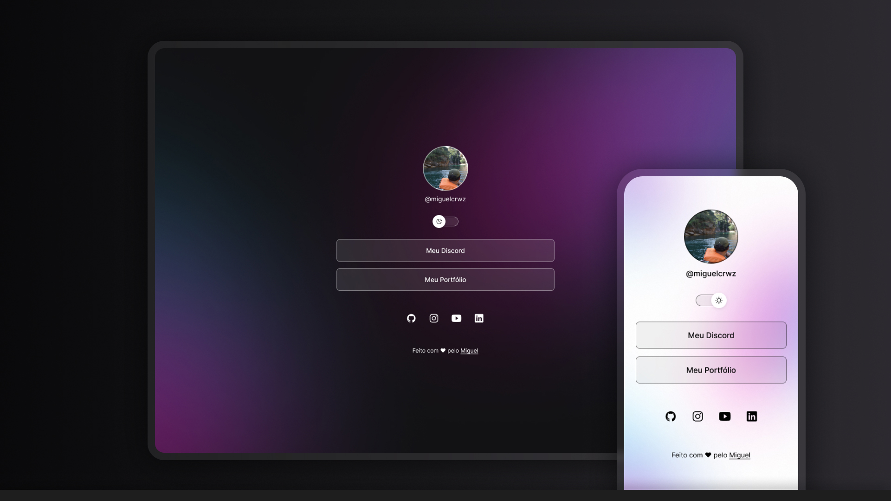

<h1 align="center"> LINKS </h1>

PROGRAMA EXCLUSIVO para ESTUDO de tecnologias WEB.

  <a href="#-tecnologias">TECNOLOGIAS</a>&nbsp;&nbsp;&nbsp;|&nbsp;&nbsp;&nbsp;
  <a href="#-projeto">PROJETO</a>&nbsp;&nbsp;&nbsp;|&nbsp;&nbsp;&nbsp;
  <a href="#memo-licença">LICENÇA</a>

  

 

  

## 💻 TECNOLOGIAS

Esse projeto foi desenvolvido com as seguintes tecnologias:

- HTML e CSS
- JavaScript
- Git e Github
- Figma

## 💻 PROJETO

O projetoLINKS é um agregador de links para usar como cartão de visitas online.

- [PROJETO ONLINE](https://miguwlcrwz.github.io/projetoLINKS)

## :memo: LICENÇA

Esse projeto está sob a licença MIT.

---

Feito com ❤ pelo Miguel